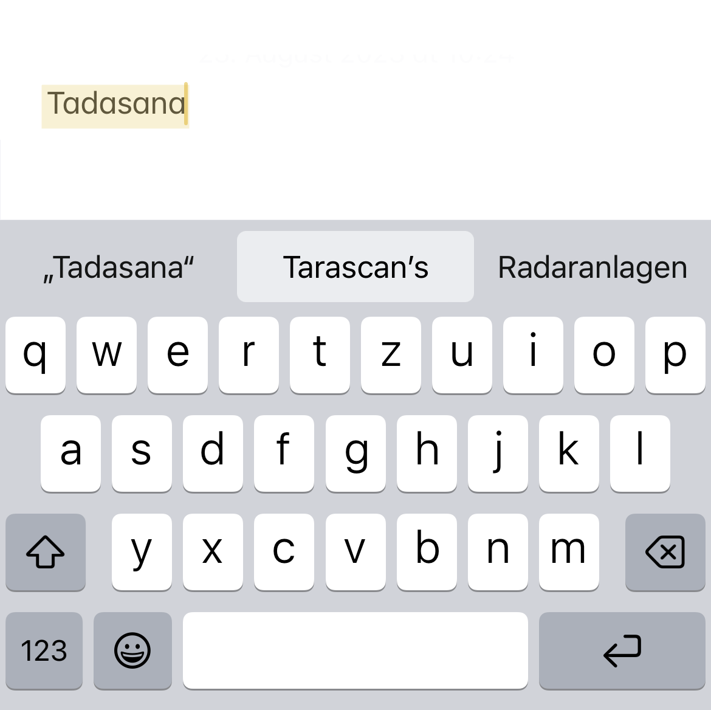
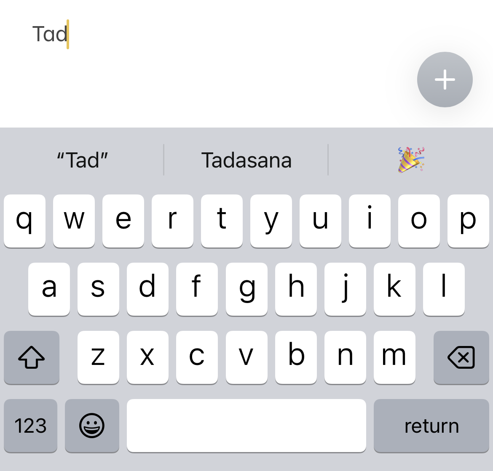

# Sanskrit Auto-Correction for iOS

This app lets you add all the Sanskrit terms that a yoga teacher might need to the user dictionary of your iOS device.

Turn this:

into this:

### How to use

To prevent apps from flooding your dictionary, the terms don't immediately appear as suggestions. At first, the words are simply not marked as _wrong_ anymore.

After you type a word ~2 times, it will appear as a suggestion as well.